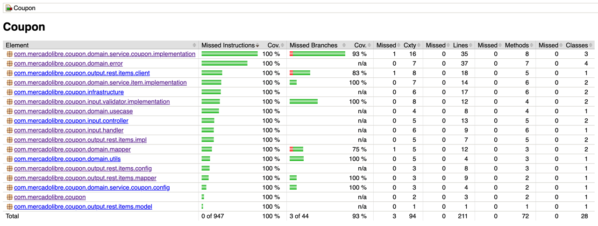

# Coupon Meli

Prueba técnica de MercadoLibre.

Se busca construir una API que dado una lista de productos y el monto total pueda darle la lista de productos
que maximice el total gastado sin excederlo.

Aclaraciones:

- Sólo se puede comprar una unidad por item_id.
- No hay preferencia en la cantidad total de ítems siempre y cuando gasten el máximo
  posible.

## Supuestos y definiciones para la resolución

El enunciado indica que se desea maximizar el total gastado. Si bien esto da a entender que se desea encontrar
la mejor combinación posible entre todos los productos, el ejemplo suministrado solamente
realiza chequeos secuenciales y en orden, sin realizar una búsqueda exhaustiva para garantizar que se han analizado
todas las combinaciones.

Ejemplo suministrado:

MLA1 $100
MLA2 $210
MLA3 $220
MLA4 $80
MLA5 $90

Según el enunciado la respuesta es MLA1, MLA2, MLA4 y MLA5, dando como resultado $480.


Sin embargo, la solución que da mayor maximización del monto es la siguiente:

MLA1, MLA3, MLA4 y MLA5, dando como resultado $490.

A esta solución más óptima se llega chequeando todas las posibles combinaciones, y no sólo secuencialmente.

Por lo tanto ante esta discrepancia entre lo solicitado (foco en la maximización) y el ejemplo dado (no es la mejor maximización que puede
encontrarse), se ha decidido brindar dos algoritmos, uno secuencial y otro
exhaustivo:

1) El primer
   algoritmo [FastSequentialCalculationCouponService.java](src%2Fmain%2Fjava%2Fcom%2Fmercadolibre%2Fcoupon%2Fdomain%2Fservice%2Fcoupon%2Fimplementation%2FFastSequentialCalculationCouponService.java)
   es el que se usa por defecto en la aplicación,
   realiza chequeos secuenciales que permiten escalar a consultas de grandes cantidades de
   productos y montos.
   Su complejidad computacional es O(n), siendo n la cantidad de itemIds. Está alineado con el ejemplo suministrado y su foco está en la
   velocidad. Sin embargo,
   sacrifica la posibilidad de encontrar la mejor solución posible para maximizar el monto total.

   Dado que el enunciado indica que hay usuarios que podrían tener miles de favoritos, y que no se indica un límite para los montos, este
   algoritmo se vuelve ideal para
   esta casuística en la que se esperan 100.000k de usuarios.

Posibles Mejoras: Durante la iteración en busca de la maximización podría realizarse una validación extra que permita cortar rápidamente si
se encuentra un producto con un precio igual al monto máximo. Esto implicaría no seguir el approach secuencial comentado anteriormente, ya
que descartaria todas las sumas que se hayan realizado hasta el momento.

2) El segundo
   algoritmo [OptimizedCalculationCouponService.java](src%2Fmain%2Fjava%2Fcom%2Fmercadolibre%2Fcoupon%2Fdomain%2Fservice%2Fcoupon%2Fimplementation%2FOptimizedCalculationCouponService.java)
   se encuentra desactivado en la aplicación. Realiza una búsqueda exhaustiva probando todas las combinaciones posibles para encontrar la
   solución más óptima.
   Su complejidad computacional es n^2, siendo n la cantidad de itemIds, por lo que no es viable para casos con una baja cantidad de
   productos. Dado que se indica que los usuarios pueden llegar a tener miles de productos, no es una solución escalable.
   Podría llegar a ser viable en caso en que se limitaran las consultas a una cantidad especifica de productos.

Se han realizado mejoras
para optimizar el
algoritmo, como por ejemplo filtrar los items que superen el monto máximo indicado, o guardar en cache distribuida los items con sus
precios. También el rendimiento dependerá de la
cantidad de instancias que se desee poner en funcionamiento.

Se podría implementar también una opción híbrida: Garantizar optimización (segundo algoritmo) para casos con pocos productos, pero si se
consultan una gran
cantidad priorizar el algoritmo más veloz (primer algoritmo).

## Arquitectura


El servicio se encuentra desplegado en AWS. Consta de un Load Balancer para poder repartir el tráfico entre las distintas instancias, un
Auto Scaling Group para poder escalar y desescalar según necesidad y finalmente instancias EC2 que poseen la aplicación en funcionamiento y
se conectan
tanto al api de items como a una cache distribuida en donde se guarda la información de los productos con sus precios, ya que se indica que
generalmente se consultan los mismos productos.

## Cobertura

Se ha llegado al 100% del coverage:



## Ejecutar el servicio localmente

Para ejecutarlo se deberá tener instalado docker y docker-compose:

Primero se deberá descargar/clonar el repositorio con git clone. Luego se ejecuta el docker compose de la siguiente manera:

```
git clone https://github.com/Albornozluciano/coupon-meli.git
cd coupon-meli
docker-compose -f compose-local.yaml up
```

Esto levantará redis y permitirá integrarnos con items api de manera local.
Se pueden realizar las pruebas mediante Postman o curl:

```
Request:

   curl --location 'localhost:8080/coupon' \
   --header 'Content-Type: application/json' \
   --data '{
       "item_ids": [
           "MLA1948462690",
           "MLA1948462691"
       ],
       "amount": 1000000
   }'
   
   
Response:
   
   Status 200
   {
       "item_ids": [
           "MLA1948462690"
       ],
       "amount": 650000.0
   }
```

Luego de realizar las pruebas se debe hacer un ```docker-compose down``` para finalizar los contenedores.

## Servicio productivo (Deprecado: se ha desactivado el servicio productivo para evitar gastos)

Se encuentra desplegado en AWS el servicio para que pueda ser usado mediante la siguiente URL:

POST -> http://couponlb-1031475203.us-east-2.elb.amazonaws.com/coupon 

Swagger: http://couponlb-1031475203.us-east-2.elb.amazonaws.com/swagger-ui/index.html

```
Request:

   curl --location 'http://couponlb-1031475203.us-east-2.elb.amazonaws.com/coupon' \
   --header 'Content-Type: application/json' \
   --data '{
       "item_ids": [
           "MLA1948462690",
           "MLA1948462691"
       ],
       "amount": 1000000
   }'
   
   
Response:
   
   Status 200
   {
       "item_ids": [
           "MLA1948462690"
       ],
       "amount": 650000.0
   }
```

Importante: En caso de uso excesivo de este servicio podría incurrirme en gastos económicos por parte de AWS, por lo que pido amablemente
hacer uso de él responsablemente (peticiones aisladas si, pruebas de carga no :) )

## Pruebas de carga (Solo en local)

Se encuentra disponible la herramienta k6 con scripts preparados para realizar pruebas de carga.

Sin embargo, es importante no realizar estas pruebas integrándonos con el servicio externo de items-api de mercadolibre ya que podemos
saturarlo (aunque existen rate limiters para evitar esto, mejor no llegar a este punto).

Por lo tanto, se ha añadido también la herramienta "simulado" con mocks. Los scripts de prueba de carga garantizan que los productos a
consultar sean elegidos aleatoriamente de la lista de mocks, tratando de simular lo mejor posible un comportamiento real de los usuarios.

Para ejecutar el script se debera lanzar el siguiente comando:

```
docker-compose down (en caso en que previamente se haya levantado los containers con la version sin mocks)
docker-compose -f compose-local-load-tests.yaml up
```

Esto preparará una versión de la aplicación que no se conecta con servicios externos y levanta las herramientas necesarias para monitorear y
realizar la prueba.

Finalmente se deberá lanzar el siguiente comando para la ejecución de k6

```
docker-compose run --rm k6 run scripts/items-local-normal.js
```

Este script realiza peticiones que llegan a un rate de 300rps, suficiente para entender cómo es la performance del servicio y extrapolar a N
instancias productivas. Existe otro script (items-local-expected.js) que permite simular el tráfico
esperado (1666rps), pero se
ha ejecutado exitosamente sólo en aws
debido al gran consumo que conlleva su ejecución y la necesidad de escalar a varias instancias, por lo que no se recomienda lanzarlo
localmente.

Para visualizar las métricas de la prueba se puede acceder a la siguiente url de grafana:

http://localhost:3000/d/Le2Ku9NMk/k6-performance-test

También se han mockeado con simulado los casos indicados en el enunciado, pudiendo de esta manera validar que el algoritmo de cálculo
devuelve lo esperado.

## Pruebas funcionales

Ejemplos de pruebas:

- 1 solo item

MLA1428221555 - $650000.00

Amount máximo es menor al precio del item


Amount máximo es igual al precio del item


Amount máximo es mayor al precio del item


- Múltiples items

Se devuelve la respuesta esperada según el enunciado al usar la implementación de FastSequentialCalculationCouponService:

```
Ejemplo similar al del enunciado:

MLA1452786471 $100000
MLA1370137609 $210000
MLA607933612 $220000
MLA1663089324 $80000
MLA1326296634 $90000

Monto máximo $500000
```


Usando el algoritmo exhaustivo se devuelve la respuesta que maximiza aún más el monto:


## Decisiones técnicas

Se han realizado una serie de decisiones técnicas para poder brindar resiliencia al servicio:

1) Se ha implementado un redis distribuido para que las instancias aprovechen información obtenida previamente y no saturar el servicio
   externo (items)
2) Las peticiones a items que devuelvan 404 se cachean como objeto vacio para evitar realizar peticiones innecesarias nuevamente.
3) Las peticiones a item que fallan con status 5xx o que no son del cliente NO se cachean, y no provocan errores en el servicio de coupon
   dado que se mapea como un item vacio.
4) Se ha implementado un circuit breaker para evitar saturar a items-api en caso de múltiples peticiones fallidas por status 5xx, con el
   objetivo de permitirles recuperar el servicio de una manera más fácil. En este caso sí que se devuelve el error hacia afuera en coupon.
5) Las peticiones a items se realizan de manera asíncrona (se usan virtual threads). En caso de ser un problema por la cantidad de
   peticiones hacia items, se puede aplicar un approach distinto: realizar peticiones en ráfagas y chequear con el método "calculate" cada
   vez que termine una ráfaga para validar si se encuentra alguna solución y poder retornar antes de consultar todos los items solicitados.
6) Como posible mejora habría que diferenciar los status 4xx de items api, es decir, en caso de 429 no deberia cachearse la respuesta.

## Contacto

En caso de dudas o preguntas pueden contactarse conmigo mediante casilla de correo: albornozlucianojulian@gmail.com
